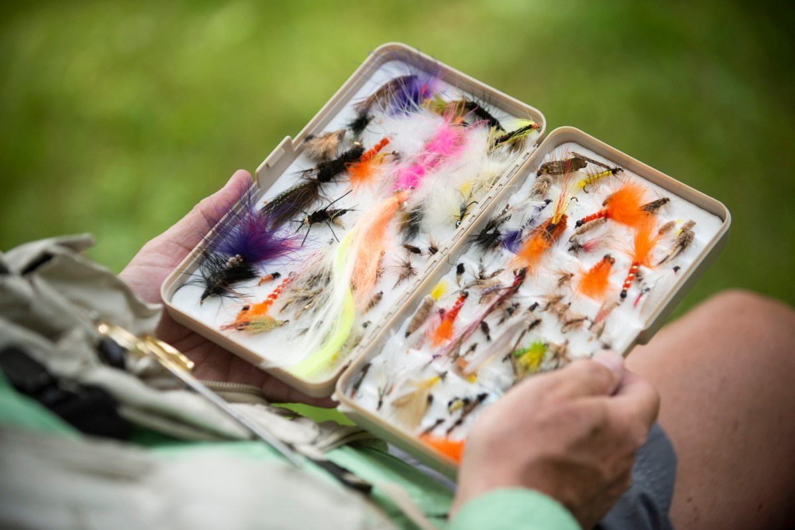

Fly fishing can be a confusing, confounding, complicated activity. Even after you figure out which rod, and what kind of reel, and which line and leader you need, you’ll have to decide which fly to attach to your tippet.

And there are thousands to choose from.

Don’t fret. Just remember: You’ll be learning about fly fishing for the rest of your life, and you’ll never know it all. And all of us started somewhere.

Often I’m asked, “What if I just want to have a few flies on hand that will give me a reasonably good chance at catching whatever’s out there, no matter the species or the season?”

Sounds like a pipe dream, but it’s really not. In fact, I’d feel confident fishing these five flies in nearly all conditions you’ll find here in Maine, and I bet they’d work fine elsewhere as well. Let’s call ’em “Five flies to get you by (until you learn how to match the hatch).”

First up is the venerable Gray Ghost, a streamer fly invented by Rangeley’s Carrie Stevens back in 1924. The fly resembles a bait fish, and can be fished by casting out and stripping the line back in briskly (like an injured smelt).

My second choice — the woolly bugger — is remarkably versatile, and just as easy to tie. When I learned to tie my own flies, it was the first one our instructors taught us. It looks kind of like a leech, and will attract everything from trout to bass. Get one with a brass conehead and it’ll sink a bit deeper.

If you’re fishing for trout in Maine, you must have a few of Alvin Theriault’s maple syrup flies in your vest. Theriault is a retired game warden who lives in Stacyville, and he invented the fly so that his young daughter would have a pattern that she could tie and sell. She sold so many of them, she put herself through college on the proceeds. And she wouldn’t have sold that many if they didn’t catch fish. Period.

Maybe you don’t know if you want to fish a fly that floats, or one that will attract fish by darting below the surface. Maybe you need a muddler minnow. It’s made of densely packed — “spun” is the correct term — deer hair that is very buoyant. But twitch the fly toward you and it’ll sink, then bob back above the water. It drives trout crazy. And bass. And anything else you might be fishing for.

Finally, there’s the classic Adams dry fly, which is perfect for days when you see fish feeding on the surface, but can’t figure out what they’re eating. The Adams isn’t a replica of any specific insect. Instead, it shares the characteristics of many different bugs, and can be just different (and tasty) enough to fool a fish that has been feeding on something else.