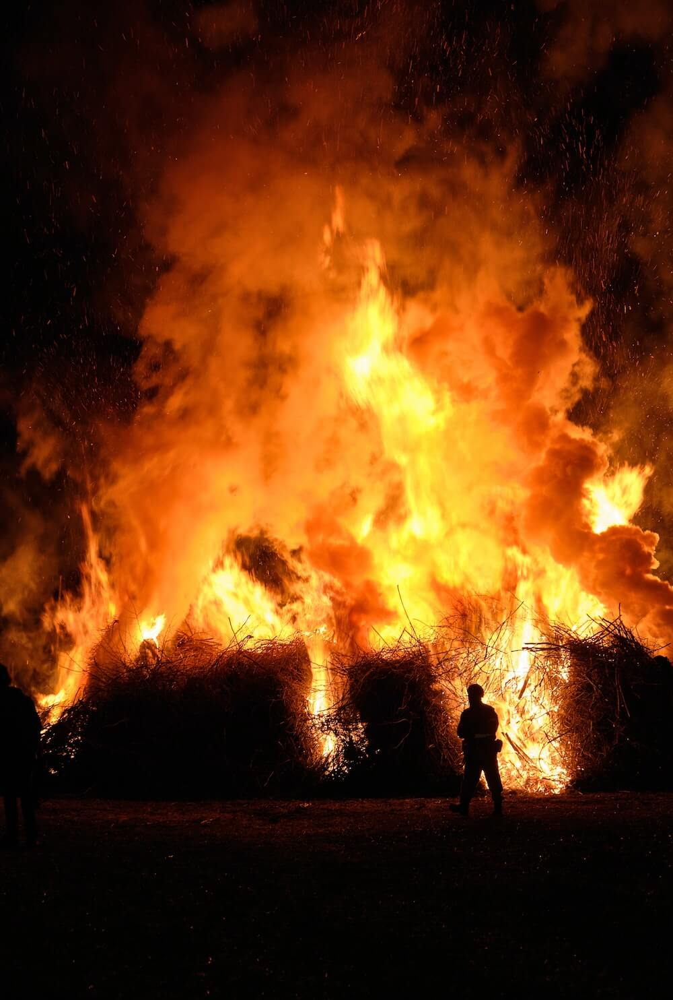

It was a familiar scene for firefighters at Camp Eildon Lake last night, with the former campgrounds burning brightly exactly 20 years to the day after the infamous massacre. For many of the crew, they could still recall the first time they had been called out to douse the flames. Some were hesitant to go, wary of finding yet another series of corpses as they had in the original fire.

“It’s weird, you know?” said fire chief Norman Landa, “it feels like just yesterday we were called to do this exact same thing, the sight of those burning bodies are still etched in my mind. And now today, exactly 20 years later, we get the call it’s burning up again.”

Thankfully, this time around, no bodies were found amongst the flames, but there were some on the crew who claim they saw a shadowy figure walking through the fire.

“It plays tricks on you sometimes, the flames and smoke can take almost any shape,” said chief Landa. “But, I’ve seen plenty of fires in my day, but I swear this was the closest I’ve seen to someone actually walking through the flames. It was like a ghost of the past was walking between us.”

Landa’s suggestion of a ghost from the past has led many in the community to speculate that the spirit of Henry Miller still haunts the camp. Miller, the deranged camp counsellor who murdered over 20 people in a savage massacre in 1991, was never officially confirmed to have been found in the fire. A body, matching his general height and characteristics was found, but the body was too severely burned to be positively identified.

When asked by the *Eildon Tribune*, Senior Constable Loomis of the Eildon Police Force vehemently denied it could have been Miller in the fire. “Of course it’s not him. You think that even if he wasn’t in the fire back in 91, he could have been living out here in the 20 years since? Look at this place, it’s a hellhole. There was nothing left, I’m surprised this place could even catch fire again, there’s nothing here.”

As of this morning, the site is still full of firefighters and law enforcement, who are investigating how the fire could have begun. Until the investigation is complete, authorities are asking people to remain far from the site, and wish to remind the public that “this is not a place of fascination, it’s a place of tragedy that needs to be left in the past.”