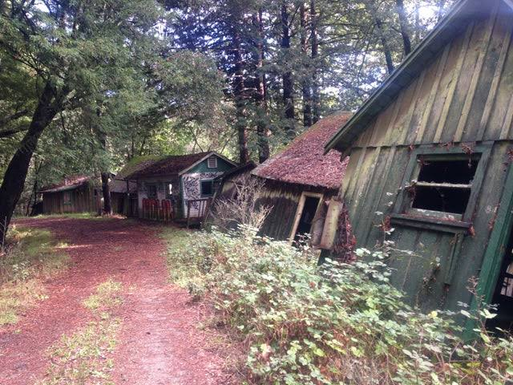
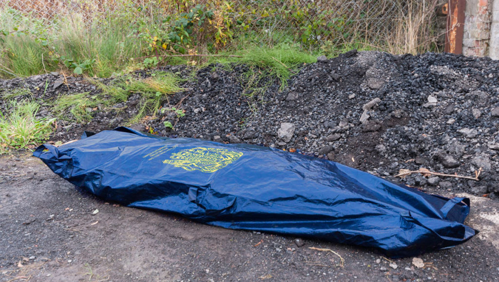

Remembrance turned to reminiscence yesterday as the 5 year anniversary service of the Camp Eildon Lake Massacre took a turn for the horrific. Saturday’s service, in honour of Henry Miller’s 22 victims in his brutal 1991 slaughter, was supposed to be a sombre event to remember the family members and friends lost. Instead, it became an all too familiar scene for those attending, with 4 more murders committed during the ceremonies.

To add an extra dimension to what is already a horrific and bitter event, the as yet unknown murderer chose to homage Miller by carrying out the killings with an axe. At the time of writing, the weapon has not been found, but according to the coroner, appears to be similar in size and shape to the axe used in 1991.

The service, held on the grounds of Camp Eildon Lake, began midday yesterday, 5 years and 2 days after the original massacre. The camp was permanently closed in 1991 after an investigation into the murders could not identify the cause of Miller’s rampage. The camp’s owners, who could not dispel the memory of the attacks, opted to permanently shutter the business and abandon the campgrounds at the conclusion of the investigation.

Set against such a wild, abandoned and tragic setting, the service originally exuded an air of quiet respect to the memory of those who perished, though Henry Miller’s family was apparently asked in advance not to attend. This reporter, who was present at the service, can confirm the service was a peaceful affair, up until the point the bodies were discovered by a mourner returning to their car to retrieve a packet of tissues.

“I don’t know how they could have got there, I didn’t see anyone, I didn’t hear anything,” said the mourner, who has asked to remain anonymous. “It’s like they just appeared, I have no idea where they could have been killed, or who could have put them there.”

The police were called, and a new investigation opened on the grounds, bringing back painful memories for the crowd, many of whom had been investigated in that same spot only 5 years ago. At the time of writing, the police have no suspects, but Senior Constable Loomis is confident they will catch the killer.

“We will continue this investigation as long as it takes,” Loomis tells the *Eildon Tribune.* “To do something like this, something so stupid and blatantly upsetting, it goes beyond just murder. The killer knew exactly what they were doing, taunting every single person who attended today’s service, and I won’t stand for it.”