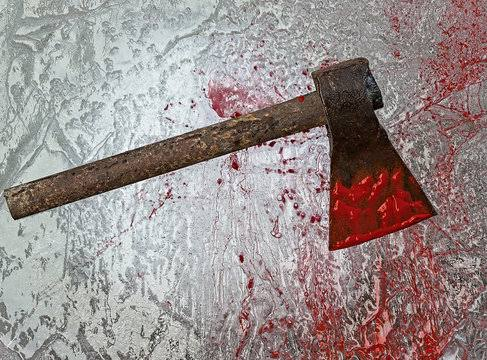
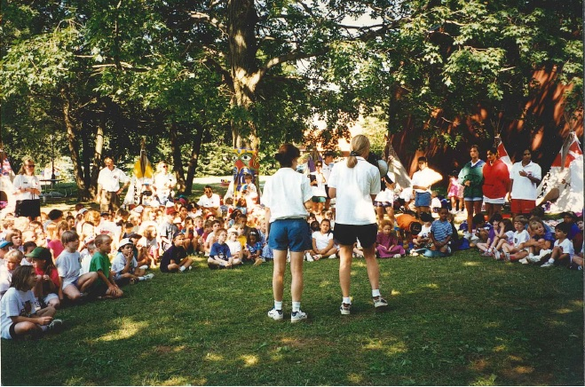

The *Eildon Tribune* is shocked to learn that yesterday afternoon, October 31, camp counsellor Henry Miller went on a brutal, bloody murder spree at Camp Eildon Lake. The counsellor, only 15 years old, took an axe and struck down 22 people, including campers, fellow teenage counsellors, and adult camp organisers.

Following this rampage, Miller attempted to burn the camp down by lighting a number of cabins on fire. In a tragic (although this paper cannot deny it is perhaps justified) turn of events, Miller was trapped inside one of these burning cabins, and perished in the fire.

The purpose of his savage attacks is unknown, with survivors of the massacre stating there was nothing they knew of that might have provoked Miller to such violence. Fellow surviving counsellors, who wish to remain anonymous, described Miller as “a fun guy, who seemed genuinely invested in giving the campers a good time.”

Emergency services were not called until hours after the event, as phone lines at the camp were cut, presumably by Miller. It was not until late into the evening that Judy Myers, another counsellor at the camp, ran to town and alerted authorities. She managed to escape with a small number of campers who were practicing archery by shooting at Miller as he ran towards the group with an axe.

“I heard screams coming from the camp hall,” Myers exclusively tells the *Eildon Tribune*. “Then, I saw Henry running towards us swinging an axe. I could tell in his eyes he wasn’t playing around, so I began firing arrows towards him. He disappeared behind a tree, so I told the kids to run, and we all vanished off into the forest.”

After ensuring the children were safely hidden amongst bushes, Myers made the long run into town and immediately went to the police. Initially sceptical, the police took her more seriously after trying to call the camp with no response.

A patrol was sent out to Camp Eildon Lake, and immediately radioed for backup as they saw thick black plumes of smoke rising above the trees. Soon, the campground was swarming with police trying to retain as much evidence as they could, while firefighters worked around them to get the situation under control amidst the fading light.

After hours of work, the situation was brought under control, with the fire put out, and everyone accounted for, some dead,, some alive. In total, 23 bodies were found at the camp, with what is presumed to be the body of Henry Miller being found last at approximately 3am.

The corpse was autopsied late last night, and found to be missing many parts, including a large portion of the left leg, a number of internal organs including the heart, stomach and liver, as well as a majority of teeth. These missing items are likely due to the intense heat it was subjected to for hours while the cabin it was found in burned down. The body was also not found with any dog tags, which were issued to all counsellors, but this matches eye-witness reports stating Miller was not wearing his dog tags as he rampaged around camp.

The camp, opened in 1978, has refused to comment on the incident, other than to express their sorrow and regret to all those affected, and to say they are looking into the matter. Pending further investigation, the camp has been closed, with all campers, counsellors and other staff sent home until a through analysis of what happened has been completed.